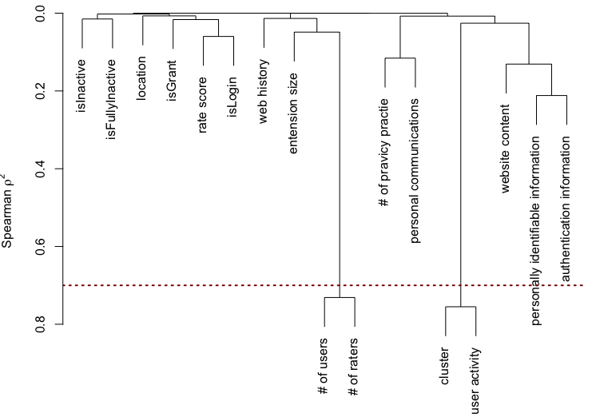

# Chrome Extension Data Processing - Supplemental Materials
Supplemental materials for paper "Impact of Extensions on Browser Performance: An Empirical Study on Google Chrome".

# Introduction
We organize the replication package into three file folders:
1. Experiment: this folder contains code for our main experiment (i.e., collecting extensions, selecting representative extensions, and measuring the extensions);

2. Analysis: this folder contains code for two parts:

	2.1 Browser Performance Evaluation: the statistical methods (i.e., the wilcoxon signed-rank test and the Cliff's Delta test) and the change ratio calculation;
	
	2.2 Linear Mixed Effects Model: factor selection helper, model optimization, and model builder.
	
3. Results: this folder contains the extension information stored in database, the clustering result in an excel file, extension selection steps in an excel file, installation packages of extensions, raw measurement data, and saved linear mixed effects models for our paper;

Our code is based on the following packages and versions:
* Python: 3.10.6
* Selenium: 4.4.0
* pyautogui: 0.9.53
* Numpy: 1.23.2
* Pandas: 1.4.3
* Sqlite3: 2.6.0
* Kmedoids: 0.3.3
* cliffs_delta: 1.0.0
* Scipy: 1.9.3
* R: 4.2.2

# Experiment
This part contains code for our main experiment in collecting the extension information from the Chrome Web Store, selecting representative extensions, and measuring the performance changes of the representative extensions. All code could be found under the experiment folder.

1. Crawler script

	This script (``collect.py``) is an automated script used to collect information of all extensions in the Chrome Web Store.

2. Extension Selection

	This script (``selecting representative extensions.ipynb``) guides the process of selecting extensions step by step.

3. Measurement

	This script (``measure.py``) is used to monitor the changes of the browser performance in terms of the page load time, the page load energy consumption, and the stabilized energy consumption.

# Analysis
This part contains code and materials for processing the dataset. The materials are introduced in two parts: Performance Evaluation (for RQs 1 and 2) and Linear Mixed Effects Models (for RQ3). All code could be found under the preprocessing folder.

  ## Performance Evaluation
  This part contains code for processing the measured raw data (for RQ1 and RQ2). The script ``performance evaluation.ipynb`` guides to process the raw data step by step and exports the processed result as an excel that will be used for the Linear Mixed-Effects Model in RQ3. Specifically, this script consists of three parts:
  
    1. Normalization

    2. Statistical analysis
      
    3. Performance change ratio
    
  ## Linear Mixed-Effects Models
  This part contains the code for constructing the linear mixed-effects model in RQ3. 
  
  Use ``correlation and redundancy.R`` to perform correlation and redundancy analysis for the fixed effects. 
  
  ``helper.ipynb`` is used to determine the best converge random effects (e.g., (1|random) and (random1|random2) ). 
  
  Following the steps, input the result from ``helper.ipynb`` to ``buildHelp.R`` or ``buildHelp2.R`` to automatically filter the converged variables. 
  
  Lastly, using ``builder.R`` to conduct a stepwise elimination to obtain the optimal formula.
The defined optimal formula is required to use ``lmer4`` to construct model again and use ``Anova`` and ``fixef`` provied in ``car`` to find the results and effect. ``Summary(model)`` may be useful as well.

# Results
This part contains the output data from our main experiments. All output files could be found under the results folder.
This folder contains the extension information stored in database, the clustering result in an excel file, extension selection steps in an excel file, installation packages of extensions, raw measurement data, and saved linear mixed effects models for our paper;

1. Extension information

	The collected information of all extensions in the Chrome Web Store are presented in the forms of SQL and database, which can be found in ``extensions.sql`` and ``plugin.db``.

2. The result of clustering extensions

	The output file (``kmedoids.xlsx``) contains the clustering result by K-medoid clustering algorithm.

3. The details of manually selecting extensions

	The output file (``extension selection steps.xlsx``) contains the process of selecting representative extensions with reasons provided.

4. Installation packages of extensions

	All candidate extensions (representative + discarded) are presented in folder crx. The installation packages of extensions are named by the extension ids. The folder name under crx (e.g., 1 and 2) is related to the cluter. For example, the selected extensions that are clutered to cluster 1, can be found in crx -> 1.
	
5. Raw data

	Our measurements to the browser performance can be found under the folder - raw performance data. ``Free.txt`` contains the measurements for the extension-free mode. The file ``full.txt`` contains the measurements for the fully loaded mode.
	
6. model results

	Our linear mixed effects models can be found in the folder - saved models. To load the model, ``robustlmm`` function in R is required. Run ``readRDS("page load time.rds")`` to load the model in local.
 
## Table: Statistical performance changes of the Extensions in different activation modes of extension
<table style="border-collapse: collapse; border: none; border-spacing: 0px;">
	<tr>
		<td style="border-right-width: 1px; border-right-style: solid; border-right-color: black; border-top-width: 1px; border-top-style: solid; border-top-color: black; border-bottom-width: 1px; border-bottom-style: solid; border-bottom-color: black; padding-right: 3pt; padding-left: 3pt;" colspan="2">
			Mode
		</td>
		<td style="border-right-width: 1px; border-right-style: solid; border-right-color: black; border-top-width: 1px; border-top-style: solid; border-top-color: black; border-bottom-width: 1px; border-bottom-style: solid; border-bottom-color: black; text-align: center; padding-right: 3pt; padding-left: 3pt;" colspan="8">
			No Grant
		</td>
		<td style="border-top-width: 1px; border-top-style: solid; border-top-color: black; border-bottom-width: 1px; border-bottom-style: solid; border-bottom-color: black; text-align: center; padding-right: 3pt; padding-left: 3pt;" colspan="8">
			No Login
		</td>
	</tr>
	<tr>
		<td style="border-right-width: 1px; border-right-style: solid; border-right-color: black; border-bottom-width: 1px; border-bottom-style: solid; border-bottom-color: black; padding-right: 3pt; padding-left: 3pt;" colspan="2">
			Cliff’s Delta
		</td>
		<td style="border-bottom-width: 1px; border-bottom-style: solid; border-bottom-color: black; text-align: center; padding-right: 3pt; padding-left: 3pt;" colspan="2">
			Signif.
			 
		</td>
		<td style="border-bottom-width: 1px; border-bottom-style: solid; border-bottom-color: black; text-align: center; padding-right: 3pt; padding-left: 3pt;" colspan="2">
			Small
		</td>
		<td style="border-bottom-width: 1px; border-bottom-style: solid; border-bottom-color: black; text-align: center; padding-right: 3pt; padding-left: 3pt;" colspan="2">
			Medium
		</td>
		<td style="border-right-width: 1px; border-right-style: solid; border-right-color: black; border-bottom-width: 1px; border-bottom-style: solid; border-bottom-color: black; text-align: center; padding-right: 3pt; padding-left: 3pt;" colspan="2">
			Large
		</td>
		<td style="border-bottom-width: 1px; border-bottom-style: solid; border-bottom-color: black; text-align: center; padding-right: 3pt; padding-left: 3pt;" colspan="2">
			Signif.<wbr>
		</td>
		<td style="border-bottom-width: 1px; border-bottom-style: solid; border-bottom-color: black; text-align: center; padding-right: 3pt; padding-left: 3pt;" colspan="2">
			Small
		</td>
		<td style="border-bottom-width: 1px; border-bottom-style: solid; border-bottom-color: black; text-align: center; padding-right: 3pt; padding-left: 3pt;" colspan="2">
			Medium
		</td>
		<td style="border-bottom-width: 1px; border-bottom-style: solid; border-bottom-color: black; text-align: center; padding-right: 3pt; padding-left: 3pt;" colspan="2">
			Large
		</td>
	</tr>
	<tr>
		<td style="border-right-width: 1px; border-right-style: solid; border-right-color: black; border-bottom-width: 1px; border-bottom-style: solid; border-bottom-color: black; padding-right: 3pt; padding-left: 3pt;">
			Performance
			 
			metric<wbr>
		</td>
		<td style="border-right-width: 1px; border-right-style: solid; border-right-color: black; border-bottom-width: 1px; border-bottom-style: solid; border-bottom-color: black; padding-right: 3pt; padding-left: 3pt;">
			Change ratio
		</td>
		<td style="border-bottom-width: 1px; border-bottom-style: solid; border-bottom-color: black; text-align: center; padding-right: 3pt; padding-left: 3pt;">
			Count<wbr>
		</td>
		<td style="border-bottom-width: 1px; border-bottom-style: solid; border-bottom-color: black; text-align: center; padding-right: 3pt; padding-left: 3pt;">
			Ratio<wbr>
		</td>
		<td style="border-bottom-width: 1px; border-bottom-style: solid; border-bottom-color: black; text-align: center; padding-right: 3pt; padding-left: 3pt;">
			Count
		</td>
		<td style="border-bottom-width: 1px; border-bottom-style: solid; border-bottom-color: black; text-align: center; padding-right: 3pt; padding-left: 3pt;">
			Ratio
		</td>
		<td style="border-bottom-width: 1px; border-bottom-style: solid; border-bottom-color: black; text-align: center; padding-right: 3pt; padding-left: 3pt;">
			Count
		</td>
		<td style="border-bottom-width: 1px; border-bottom-style: solid; border-bottom-color: black; text-align: center; padding-right: 3pt; padding-left: 3pt;">
			Ratio
		</td>
		<td style="border-bottom-width: 1px; border-bottom-style: solid; border-bottom-color: black; text-align: center; padding-right: 3pt; padding-left: 3pt;">
			Count
		</td>
		<td style="border-right-width: 1px; border-right-style: solid; border-right-color: black; border-bottom-width: 1px; border-bottom-style: solid; border-bottom-color: black; text-align: center; padding-right: 3pt; padding-left: 3pt;">
			Ratio
		</td>
		<td style="border-bottom-width: 1px; border-bottom-style: solid; border-bottom-color: black; text-align: center; padding-right: 3pt; padding-left: 3pt;">
			Count<wbr>
		</td>
		<td style="border-bottom-width: 1px; border-bottom-style: solid; border-bottom-color: black; text-align: center; padding-right: 3pt; padding-left: 3pt;">
			Ratio
		</td>
		<td style="border-bottom-width: 1px; border-bottom-style: solid; border-bottom-color: black; text-align: center; padding-right: 3pt; padding-left: 3pt;">
			Count
		</td>
		<td style="border-bottom-width: 1px; border-bottom-style: solid; border-bottom-color: black; text-align: center; padding-right: 3pt; padding-left: 3pt;">
			Ratio
		</td>
		<td style="border-bottom-width: 1px; border-bottom-style: solid; border-bottom-color: black; text-align: center; padding-right: 3pt; padding-left: 3pt;">
			Count
		</td>
		<td style="border-bottom-width: 1px; border-bottom-style: solid; border-bottom-color: black; text-align: center; padding-right: 3pt; padding-left: 3pt;">
			Ratio
		</td>
		<td style="border-bottom-width: 1px; border-bottom-style: solid; border-bottom-color: black; text-align: center; padding-right: 3pt; padding-left: 3pt;">
			Count
		</td>
		<td style="border-bottom-width: 1px; border-bottom-style: solid; border-bottom-color: black; text-align: center; padding-right: 3pt; padding-left: 3pt;">
			Ratio
		</td>
	</tr>
	<tr>
		<td style="border-right-width: 1px; border-right-style: solid; border-right-color: black; border-bottom-width: 1px; border-bottom-style: solid; border-bottom-color: black; padding-right: 3pt; padding-left: 3pt;" rowspan="3">
			page load
			 
			time<wbr>
		</td>
		<td style="border-right-width: 1px; border-right-style: solid; border-right-color: black; border-bottom-width: 1px; border-bottom-style: solid; border-bottom-color: black; padding-right: 3pt; padding-left: 3pt;">
			Increase
		</td>
		<td style="padding-right: 3pt; padding-left: 3pt;">
			1
		</td>
		<td style="text-align: right; padding-right: 3pt; padding-left: 3pt;">
			13.37%
		</td>
		<td style="padding-right: 3pt; padding-left: 3pt;">
			1
		</td>
		<td style="text-align: right; padding-right: 3pt; padding-left: 3pt;">
			13.37%
		</td>
		<td style="padding-right: 3pt; padding-left: 3pt;">
		</td>
		<td style="text-align: right; padding-right: 3pt; padding-left: 3pt;">
		</td>
		<td style="padding-right: 3pt; padding-left: 3pt;">
		</td>
		<td style="border-right-width: 1px; border-right-style: solid; border-right-color: black; padding-right: 3pt; padding-left: 3pt;">
		</td>
		<td style="padding-right: 3pt; padding-left: 3pt;">
			1
		</td>
		<td style="text-align: right; padding-right: 3pt; padding-left: 3pt;">
			33.16%
		</td>
		<td style="padding-right: 3pt; padding-left: 3pt;">
			1
		</td>
		<td style="text-align: right; padding-right: 3pt; padding-left: 3pt;">
			33.16%
		</td>
		<td style="padding-right: 3pt; padding-left: 3pt;">
		</td>
		<td style="padding-right: 3pt; padding-left: 3pt;">
		</td>
		<td style="padding-right: 3pt; padding-left: 3pt;">
		</td>
		<td style="padding-right: 3pt; padding-left: 3pt;">
		</td>
	</tr>
	<tr>
		<td style="border-right-width: 1px; border-right-style: solid; border-right-color: black; border-bottom-width: 1px; border-bottom-style: solid; border-bottom-color: black; padding-right: 3pt; padding-left: 3pt;">
			Decrease
		</td>
		<td style="padding-right: 3pt; padding-left: 3pt;">
			4
		</td>
		<td style="text-align: right; padding-right: 3pt; padding-left: 3pt;">
			-6.92%
		</td>
		<td style="padding-right: 3pt; padding-left: 3pt;">
			3
		</td>
		<td style="text-align: right; padding-right: 3pt; padding-left: 3pt;">
			-6.51%
		</td>
		<td style="padding-right: 3pt; padding-left: 3pt;">
			1
		</td>
		<td style="text-align: right; padding-right: 3pt; padding-left: 3pt;">
			-8.86%
		</td>
		<td style="padding-right: 3pt; padding-left: 3pt;">
		</td>
		<td style="border-right-width: 1px; border-right-style: solid; border-right-color: black; padding-right: 3pt; padding-left: 3pt;">
		</td>
		<td style="padding-right: 3pt; padding-left: 3pt;">
			1
		</td>
		<td style="text-align: right; padding-right: 3pt; padding-left: 3pt;">
			-7.08%
		</td>
		<td style="padding-right: 3pt; padding-left: 3pt;">
			1
		</td>
		<td style="text-align: right; padding-right: 3pt; padding-left: 3pt;">
			-7.08%
		</td>
		<td style="padding-right: 3pt; padding-left: 3pt;">
		</td>
		<td style="padding-right: 3pt; padding-left: 3pt;">
		</td>
		<td style="padding-right: 3pt; padding-left: 3pt;">
		</td>
		<td style="padding-right: 3pt; padding-left: 3pt;">
		</td>
	</tr>
	<tr>
		<td style="border-right-width: 1px; border-right-style: solid; border-right-color: black; border-bottom-width: 1px; border-bottom-style: solid; border-bottom-color: black; padding-right: 3pt; padding-left: 3pt;">
			Overall
		</td>
		<td style="border-bottom-width: 1px; border-bottom-style: solid; border-bottom-color: black; padding-right: 3pt; padding-left: 3pt;">
			5
		</td>
		<td style="border-bottom-width: 1px; border-bottom-style: solid; border-bottom-color: black; text-align: right; padding-right: 3pt; padding-left: 3pt;">
			-6.51%
		</td>
		<td style="border-bottom-width: 1px; border-bottom-style: solid; border-bottom-color: black; padding-right: 3pt; padding-left: 3pt;">
			4
		</td>
		<td style="border-bottom-width: 1px; border-bottom-style: solid; border-bottom-color: black; text-align: right; padding-right: 3pt; padding-left: 3pt;">
			-6.35%
		</td>
		<td style="border-bottom-width: 1px; border-bottom-style: solid; border-bottom-color: black; padding-right: 3pt; padding-left: 3pt;">
			1
		</td>
		<td style="border-bottom-width: 1px; border-bottom-style: solid; border-bottom-color: black; text-align: right; padding-right: 3pt; padding-left: 3pt;">
			-8.86%
		</td>
		<td style="border-bottom-width: 1px; border-bottom-style: solid; border-bottom-color: black; padding-right: 3pt; padding-left: 3pt;">
		</td>
		<td style="border-right-width: 1px; border-right-style: solid; border-right-color: black; border-bottom-width: 1px; border-bottom-style: solid; border-bottom-color: black; padding-right: 3pt; padding-left: 3pt;">
		</td>
		<td style="border-bottom-width: 1px; border-bottom-style: solid; border-bottom-color: black; padding-right: 3pt; padding-left: 3pt;">
			2
		</td>
		<td style="border-bottom-width: 1px; border-bottom-style: solid; border-bottom-color: black; text-align: right; padding-right: 3pt; padding-left: 3pt;">
			13.04%
		</td>
		<td style="border-bottom-width: 1px; border-bottom-style: solid; border-bottom-color: black; padding-right: 3pt; padding-left: 3pt;">
			2
		</td>
		<td style="border-bottom-width: 1px; border-bottom-style: solid; border-bottom-color: black; text-align: right; padding-right: 3pt; padding-left: 3pt;">
			13.04%
		</td>
		<td style="border-bottom-width: 1px; border-bottom-style: solid; border-bottom-color: black; padding-right: 3pt; padding-left: 3pt;">
		</td>
		<td style="border-bottom-width: 1px; border-bottom-style: solid; border-bottom-color: black; padding-right: 3pt; padding-left: 3pt;">
		</td>
		<td style="border-bottom-width: 1px; border-bottom-style: solid; border-bottom-color: black; padding-right: 3pt; padding-left: 3pt;">
		</td>
		<td style="border-bottom-width: 1px; border-bottom-style: solid; border-bottom-color: black; padding-right: 3pt; padding-left: 3pt;">
		</td>
	</tr>
	<tr>
		<td style="border-right-width: 1px; border-right-style: solid; border-right-color: black; border-bottom-width: 1px; border-bottom-style: solid; border-bottom-color: black; padding-right: 3pt; padding-left: 3pt;" rowspan="3">
			page load
			 
			energy
			 
			consumption<wbr>
		</td>
		<td style="border-right-width: 1px; border-right-style: solid; border-right-color: black; border-bottom-width: 1px; border-bottom-style: solid; border-bottom-color: black; padding-right: 3pt; padding-left: 3pt;">
			Increase
		</td>
		<td style="padding-right: 3pt; padding-left: 3pt;">
			4
		</td>
		<td style="text-align: right; padding-right: 3pt; padding-left: 3pt;">
			14.82%
		</td>
		<td style="padding-right: 3pt; padding-left: 3pt;">
			3
		</td>
		<td style="text-align: right; padding-right: 3pt; padding-left: 3pt;">
			10.68%
		</td>
		<td style="padding-right: 3pt; padding-left: 3pt;">
			1
		</td>
		<td style="text-align: right; padding-right: 3pt; padding-left: 3pt;">
			18.95%
		</td>
		<td style="padding-right: 3pt; padding-left: 3pt;">
		</td>
		<td style="border-right-width: 1px; border-right-style: solid; border-right-color: black; padding-right: 3pt; padding-left: 3pt;">
		</td>
		<td style="padding-right: 3pt; padding-left: 3pt;">
			7
		</td>
		<td style="text-align: right; padding-right: 3pt; padding-left: 3pt;">
			11.53%
		</td>
		<td style="padding-right: 3pt; padding-left: 3pt;">
			4
		</td>
		<td style="text-align: right; padding-right: 3pt; padding-left: 3pt;">
			7.06%
		</td>
		<td style="padding-right: 3pt; padding-left: 3pt;">
		</td>
		<td style="padding-right: 3pt; padding-left: 3pt;">
		</td>
		<td style="padding-right: 3pt; padding-left: 3pt;">
			3
		</td>
		<td style="text-align: right; padding-right: 3pt; padding-left: 3pt;">
			46.06%
		</td>
	</tr>
	<tr>
		<td style="border-right-width: 1px; border-right-style: solid; border-right-color: black; border-bottom-width: 1px; border-bottom-style: solid; border-bottom-color: black; padding-right: 3pt; padding-left: 3pt;">
			Decrease
		</td>
		<td style="padding-right: 3pt; padding-left: 3pt;">
		</td>
		<td style="text-align: right; padding-right: 3pt; padding-left: 3pt;">
		</td>
		<td style="padding-right: 3pt; padding-left: 3pt;">
		</td>
		<td style="text-align: right; padding-right: 3pt; padding-left: 3pt;">
		</td>
		<td style="padding-right: 3pt; padding-left: 3pt;">
		</td>
		<td style="text-align: right; padding-right: 3pt; padding-left: 3pt;">
		</td>
		<td style="padding-right: 3pt; padding-left: 3pt;">
		</td>
		<td style="border-right-width: 1px; border-right-style: solid; border-right-color: black; padding-right: 3pt; padding-left: 3pt;">
		</td>
		<td style="padding-right: 3pt; padding-left: 3pt;">
		</td>
		<td style="text-align: right; padding-right: 3pt; padding-left: 3pt;">
		</td>
		<td style="padding-right: 3pt; padding-left: 3pt;">
		</td>
		<td style="text-align: right; padding-right: 3pt; padding-left: 3pt;">
		</td>
		<td style="padding-right: 3pt; padding-left: 3pt;">
		</td>
		<td style="padding-right: 3pt; padding-left: 3pt;">
		</td>
		<td style="padding-right: 3pt; padding-left: 3pt;">
		</td>
		<td style="padding-right: 3pt; padding-left: 3pt;">
		</td>
	</tr>
	<tr>
		<td style="border-right-width: 1px; border-right-style: solid; border-right-color: black; border-bottom-width: 1px; border-bottom-style: solid; border-bottom-color: black; padding-right: 3pt; padding-left: 3pt;">
			Overall
		</td>
		<td style="border-bottom-width: 1px; border-bottom-style: solid; border-bottom-color: black; padding-right: 3pt; padding-left: 3pt;">
			4
		</td>
		<td style="border-bottom-width: 1px; border-bottom-style: solid; border-bottom-color: black; text-align: right; padding-right: 3pt; padding-left: 3pt;">
			14.82%
		</td>
		<td style="border-bottom-width: 1px; border-bottom-style: solid; border-bottom-color: black; padding-right: 3pt; padding-left: 3pt;">
			3
		</td>
		<td style="border-bottom-width: 1px; border-bottom-style: solid; border-bottom-color: black; text-align: right; padding-right: 3pt; padding-left: 3pt;">
			10.68%
		</td>
		<td style="border-bottom-width: 1px; border-bottom-style: solid; border-bottom-color: black; padding-right: 3pt; padding-left: 3pt;">
			1
		</td>
		<td style="border-bottom-width: 1px; border-bottom-style: solid; border-bottom-color: black; text-align: right; padding-right: 3pt; padding-left: 3pt;">
			18.95%
		</td>
		<td style="border-bottom-width: 1px; border-bottom-style: solid; border-bottom-color: black; padding-right: 3pt; padding-left: 3pt;">
		</td>
		<td style="border-right-width: 1px; border-right-style: solid; border-right-color: black; border-bottom-width: 1px; border-bottom-style: solid; border-bottom-color: black; padding-right: 3pt; padding-left: 3pt;">
		</td>
		<td style="border-bottom-width: 1px; border-bottom-style: solid; border-bottom-color: black; padding-right: 3pt; padding-left: 3pt;">
			7
		</td>
		<td style="border-bottom-width: 1px; border-bottom-style: solid; border-bottom-color: black; text-align: right; padding-right: 3pt; padding-left: 3pt;">
			11.53%
		</td>
		<td style="border-bottom-width: 1px; border-bottom-style: solid; border-bottom-color: black; padding-right: 3pt; padding-left: 3pt;">
			4
		</td>
		<td style="border-bottom-width: 1px; border-bottom-style: solid; border-bottom-color: black; text-align: right; padding-right: 3pt; padding-left: 3pt;">
			7.06%
		</td>
		<td style="border-bottom-width: 1px; border-bottom-style: solid; border-bottom-color: black; padding-right: 3pt; padding-left: 3pt;">
		</td>
		<td style="border-bottom-width: 1px; border-bottom-style: solid; border-bottom-color: black; padding-right: 3pt; padding-left: 3pt;">
		</td>
		<td style="border-bottom-width: 1px; border-bottom-style: solid; border-bottom-color: black; padding-right: 3pt; padding-left: 3pt;">
			3
		</td>
		<td style="border-bottom-width: 1px; border-bottom-style: solid; border-bottom-color: black; text-align: right; padding-right: 3pt; padding-left: 3pt;">
			46.06%
		</td>
	</tr>
	<tr>
		<td style="border-right-width: 1px; border-right-style: solid; border-right-color: black; border-bottom-width: 1px; border-bottom-style: solid; border-bottom-color: black; padding-right: 3pt; padding-left: 3pt;" rowspan="3">
			Stabilized
			 
			 energy
			 
			 consumption
		</td>
		<td style="border-right-width: 1px; border-right-style: solid; border-right-color: black; border-bottom-width: 1px; border-bottom-style: solid; border-bottom-color: black; padding-right: 3pt; padding-left: 3pt;">
			Increase
		</td>
		<td style="padding-right: 3pt; padding-left: 3pt;">
			9
		</td>
		<td style="text-align: right; padding-right: 3pt; padding-left: 3pt;">
			2.81%
		</td>
		<td style="padding-right: 3pt; padding-left: 3pt;">
		</td>
		<td style="padding-right: 3pt; padding-left: 3pt;">
		</td>
		<td style="padding-right: 3pt; padding-left: 3pt;">
			3
		</td>
		<td style="text-align: right; padding-right: 3pt; padding-left: 3pt;">
			2.79%
		</td>
		<td style="padding-right: 3pt; padding-left: 3pt;">
			6
		</td>
		<td style="border-right-width: 1px; border-right-style: solid; border-right-color: black; text-align: right; padding-right: 3pt; padding-left: 3pt;">
			4.29%
		</td>
		<td style="padding-right: 3pt; padding-left: 3pt;">
			8
		</td>
		<td style="text-align: right; padding-right: 3pt; padding-left: 3pt;">
			2.72%
		</td>
		<td style="padding-right: 3pt; padding-left: 3pt;">
		</td>
		<td style="padding-right: 3pt; padding-left: 3pt;">
		</td>
		<td style="padding-right: 3pt; padding-left: 3pt;">
			1
		</td>
		<td style="text-align: right; padding-right: 3pt; padding-left: 3pt;">
			2.47%
		</td>
		<td style="padding-right: 3pt; padding-left: 3pt;">
			7
		</td>
		<td style="text-align: right; padding-right: 3pt; padding-left: 3pt;">
			2.98%
		</td>
	</tr>
	<tr>
		<td style="border-right-width: 1px; border-right-style: solid; border-right-color: black; border-bottom-width: 1px; border-bottom-style: solid; border-bottom-color: black; padding-right: 3pt; padding-left: 3pt;">
			Decrease
		</td>
		<td style="padding-right: 3pt; padding-left: 3pt;">
		</td>
		<td style="text-align: right; padding-right: 3pt; padding-left: 3pt;">
		</td>
		<td style="padding-right: 3pt; padding-left: 3pt;">
		</td>
		<td style="padding-right: 3pt; padding-left: 3pt;">
		</td>
		<td style="padding-right: 3pt; padding-left: 3pt;">
		</td>
		<td style="text-align: right; padding-right: 3pt; padding-left: 3pt;">
		</td>
		<td style="padding-right: 3pt; padding-left: 3pt;">
		</td>
		<td style="border-right-width: 1px; border-right-style: solid; border-right-color: black; text-align: right; padding-right: 3pt; padding-left: 3pt;">
		</td>
		<td style="padding-right: 3pt; padding-left: 3pt;">
		</td>
		<td style="text-align: right; padding-right: 3pt; padding-left: 3pt;">
		</td>
		<td style="padding-right: 3pt; padding-left: 3pt;">
		</td>
		<td style="padding-right: 3pt; padding-left: 3pt;">
		</td>
		<td style="padding-right: 3pt; padding-left: 3pt;">
		</td>
		<td style="padding-right: 3pt; padding-left: 3pt;">
		</td>
		<td style="padding-right: 3pt; padding-left: 3pt;">
		</td>
		<td style="text-align: center; padding-right: 3pt; padding-left: 3pt;">
		</td>
	</tr>
	<tr>
		<td style="border-right-width: 1px; border-right-style: solid; border-right-color: black; border-bottom-width: 1px; border-bottom-style: solid; border-bottom-color: black; padding-right: 3pt; padding-left: 3pt;">
			Overall
		</td>
		<td style="border-bottom-width: 1px; border-bottom-style: solid; border-bottom-color: black; padding-right: 3pt; padding-left: 3pt;">
			9
		</td>
		<td style="border-bottom-width: 1px; border-bottom-style: solid; border-bottom-color: black; text-align: right; padding-right: 3pt; padding-left: 3pt;">
			2.81%
		</td>
		<td style="border-bottom-width: 1px; border-bottom-style: solid; border-bottom-color: black; padding-right: 3pt; padding-left: 3pt;">
		</td>
		<td style="border-bottom-width: 1px; border-bottom-style: solid; border-bottom-color: black; padding-right: 3pt; padding-left: 3pt;">
		</td>
		<td style="border-bottom-width: 1px; border-bottom-style: solid; border-bottom-color: black; padding-right: 3pt; padding-left: 3pt;">
			3
		</td>
		<td style="border-bottom-width: 1px; border-bottom-style: solid; border-bottom-color: black; text-align: right; padding-right: 3pt; padding-left: 3pt;">
			2.79%
		</td>
		<td style="border-bottom-width: 1px; border-bottom-style: solid; border-bottom-color: black; padding-right: 3pt; padding-left: 3pt;">
			6
		</td>
		<td style="border-right-width: 1px; border-right-style: solid; border-right-color: black; border-bottom-width: 1px; border-bottom-style: solid; border-bottom-color: black; text-align: right; padding-right: 3pt; padding-left: 3pt;">
			4.29%
		</td>
		<td style="border-bottom-width: 1px; border-bottom-style: solid; border-bottom-color: black; padding-right: 3pt; padding-left: 3pt;">
			8
		</td>
		<td style="border-bottom-width: 1px; border-bottom-style: solid; border-bottom-color: black; text-align: right; padding-right: 3pt; padding-left: 3pt;">
			2.72%
		</td>
		<td style="border-bottom-width: 1px; border-bottom-style: solid; border-bottom-color: black; padding-right: 3pt; padding-left: 3pt;">
		</td>
		<td style="border-bottom-width: 1px; border-bottom-style: solid; border-bottom-color: black; padding-right: 3pt; padding-left: 3pt;">
		</td>
		<td style="border-bottom-width: 1px; border-bottom-style: solid; border-bottom-color: black; padding-right: 3pt; padding-left: 3pt;">
			1
		</td>
		<td style="border-bottom-width: 1px; border-bottom-style: solid; border-bottom-color: black; text-align: right; padding-right: 3pt; padding-left: 3pt;">
			2.47%
		</td>
		<td style="border-bottom-width: 1px; border-bottom-style: solid; border-bottom-color: black; padding-right: 3pt; padding-left: 3pt;">
			7
		</td>
		<td style="border-bottom-width: 1px; border-bottom-style: solid; border-bottom-color: black; text-align: right; padding-right: 3pt; padding-left: 3pt;">
			2.98%
		</td>
	</tr>
	<tr>
		<td style="border-right-width: 1px; border-right-style: solid; border-right-color: black; border-bottom-width: 1px; border-bottom-style: solid; border-bottom-color: black; padding-right: 3pt; padding-left: 3pt;" colspan="2">
			# of extensions being tested
		</td>
		<td style="border-right-width: 1px; border-right-style: solid; border-right-color: black; border-bottom-width: 1px; border-bottom-style: solid; border-bottom-color: black; text-align: center; padding-right: 3pt; padding-left: 3pt;" colspan="8">
			10
		</td>
		<td style="border-bottom-width: 1px; border-bottom-style: solid; border-bottom-color: black; text-align: center; padding-right: 3pt; padding-left: 3pt;" colspan="8">
			8
		</td>
	</tr>
</table>

## Table: Statistical performance changes of the Extensions in different activation modes of extension - continue
<table style="border-collapse: collapse; border: none; border-spacing: 0px;">
	<tr>
		<td style="border-right-width: 1px; border-right-style: solid; border-right-color: black; border-top-width: 1px; border-top-style: solid; border-top-color: black; border-bottom-width: 1px; border-bottom-style: solid; border-bottom-color: black; padding-right: 3pt; padding-left: 3pt;" colspan="2">
			Mode
		</td>
		<td style="border-right-width: 1px; border-right-style: solid; border-right-color: black; border-top-width: 1px; border-top-style: solid; border-top-color: black; border-bottom-width: 1px; border-bottom-style: solid; border-bottom-color: black; text-align: center; padding-right: 3pt; padding-left: 3pt;" colspan="8">
			Inactive
		</td>
		<td style="border-top-width: 1px; border-top-style: solid; border-top-color: black; border-bottom-width: 1px; border-bottom-style: solid; border-bottom-color: black; text-align: center; padding-right: 3pt; padding-left: 3pt;" colspan="8">
			Fully Inactive
		</td>
	</tr>
	<tr>
		<td style="border-right-width: 1px; border-right-style: solid; border-right-color: black; border-bottom-width: 1px; border-bottom-style: solid; border-bottom-color: black; padding-right: 3pt; padding-left: 3pt;" colspan="2">
			Cliff’s Delta
		</td>
		<td style="border-bottom-width: 1px; border-bottom-style: solid; border-bottom-color: black; text-align: center; padding-right: 3pt; padding-left: 3pt;" colspan="2">
			Signif.
		</td>
		<td style="border-bottom-width: 1px; border-bottom-style: solid; border-bottom-color: black; text-align: center; padding-right: 3pt; padding-left: 3pt;" colspan="2">
			Small
		</td>
		<td style="border-bottom-width: 1px; border-bottom-style: solid; border-bottom-color: black; text-align: center; padding-right: 3pt; padding-left: 3pt;" colspan="2">
			Medium
		</td>
		<td style="border-right-width: 1px; border-right-style: solid; border-right-color: black; border-bottom-width: 1px; border-bottom-style: solid; border-bottom-color: black; text-align: center; padding-right: 3pt; padding-left: 3pt;" colspan="2">
			Large
		</td>
		<td style="border-bottom-width: 1px; border-bottom-style: solid; border-bottom-color: black; text-align: center; padding-right: 3pt; padding-left: 3pt;" colspan="2">
			Signif.
		</td>
		<td style="border-bottom-width: 1px; border-bottom-style: solid; border-bottom-color: black; text-align: center; padding-right: 3pt; padding-left: 3pt;" colspan="2">
			Small
		</td>
		<td style="border-bottom-width: 1px; border-bottom-style: solid; border-bottom-color: black; text-align: center; padding-right: 3pt; padding-left: 3pt;" colspan="2">
			Medium
		</td>
		<td style="border-bottom-width: 1px; border-bottom-style: solid; border-bottom-color: black; text-align: center; padding-right: 3pt; padding-left: 3pt;" colspan="2">
			Large
		</td>
	</tr>
	<tr>
		<td style="border-right-width: 1px; border-right-style: solid; border-right-color: black; border-bottom-width: 1px; border-bottom-style: solid; border-bottom-color: black; padding-right: 3pt; padding-left: 3pt;">
			Performance
			 
			metric
			 
		</td>
		<td style="border-right-width: 1px; border-right-style: solid; border-right-color: black; border-bottom-width: 1px; border-bottom-style: solid; border-bottom-color: black; padding-right: 3pt; padding-left: 3pt;">
			Tendency
		</td>
		<td style="border-bottom-width: 1px; border-bottom-style: solid; border-bottom-color: black; text-align: center; padding-right: 3pt; padding-left: 3pt;">
			Count<wbr>
		</td>
		<td style="border-bottom-width: 1px; border-bottom-style: solid; border-bottom-color: black; text-align: center; padding-right: 3pt; padding-left: 3pt;">
			Ratio<wbr>
		</td>
		<td style="border-bottom-width: 1px; border-bottom-style: solid; border-bottom-color: black; text-align: center; padding-right: 3pt; padding-left: 3pt;">
			Count
		</td>
		<td style="border-bottom-width: 1px; border-bottom-style: solid; border-bottom-color: black; text-align: center; padding-right: 3pt; padding-left: 3pt;">
			Ratio
		</td>
		<td style="border-bottom-width: 1px; border-bottom-style: solid; border-bottom-color: black; text-align: center; padding-right: 3pt; padding-left: 3pt;">
			Count
		</td>
		<td style="border-bottom-width: 1px; border-bottom-style: solid; border-bottom-color: black; text-align: center; padding-right: 3pt; padding-left: 3pt;">
			Ratio
		</td>
		<td style="border-bottom-width: 1px; border-bottom-style: solid; border-bottom-color: black; text-align: center; padding-right: 3pt; padding-left: 3pt;">
			Count
		</td>
		<td style="border-right-width: 1px; border-right-style: solid; border-right-color: black; border-bottom-width: 1px; border-bottom-style: solid; border-bottom-color: black; text-align: center; padding-right: 3pt; padding-left: 3pt;">
			Ratio
		</td>
		<td style="border-bottom-width: 1px; border-bottom-style: solid; border-bottom-color: black; text-align: center; padding-right: 3pt; padding-left: 3pt;">
			Count
		</td>
		<td style="border-bottom-width: 1px; border-bottom-style: solid; border-bottom-color: black; text-align: center; padding-right: 3pt; padding-left: 3pt;">
			Ratio
		</td>
		<td style="border-bottom-width: 1px; border-bottom-style: solid; border-bottom-color: black; text-align: center; padding-right: 3pt; padding-left: 3pt;">
			Count
		</td>
		<td style="border-bottom-width: 1px; border-bottom-style: solid; border-bottom-color: black; text-align: center; padding-right: 3pt; padding-left: 3pt;">
			Ratio
		</td>
		<td style="border-bottom-width: 1px; border-bottom-style: solid; border-bottom-color: black; text-align: center; padding-right: 3pt; padding-left: 3pt;">
			Count
		</td>
		<td style="border-bottom-width: 1px; border-bottom-style: solid; border-bottom-color: black; text-align: center; padding-right: 3pt; padding-left: 3pt;">
			Ratio
		</td>
		<td style="border-bottom-width: 1px; border-bottom-style: solid; border-bottom-color: black; text-align: center; padding-right: 3pt; padding-left: 3pt;">
			Count
		</td>
		<td style="border-bottom-width: 1px; border-bottom-style: solid; border-bottom-color: black; text-align: center; padding-right: 3pt; padding-left: 3pt;">
			Ratio
		</td>
	</tr>
	<tr>
		<td style="border-right-width: 1px; border-right-style: solid; border-right-color: black; border-bottom-width: 1px; border-bottom-style: solid; border-bottom-color: black; padding-right: 3pt; padding-left: 3pt;" rowspan="3">
			Page load
			 
			time<wbr>
		</td>
		<td style="border-right-width: 1px; border-right-style: solid; border-right-color: black; border-bottom-width: 1px; border-bottom-style: solid; border-bottom-color: black; padding-right: 3pt; padding-left: 3pt;">
			Increase
		</td>
		<td style="padding-right: 3pt; padding-left: 3pt;">
			1
		</td>
		<td style="text-align: right; padding-right: 3pt; padding-left: 3pt;">
			335.48%
		</td>
		<td style="padding-right: 3pt; padding-left: 3pt;">
		</td>
		<td style="padding-right: 3pt; padding-left: 3pt;">
		</td>
		<td style="padding-right: 3pt; padding-left: 3pt;">
		</td>
		<td style="padding-right: 3pt; padding-left: 3pt;">
		</td>
		<td style="padding-right: 3pt; padding-left: 3pt;">
			1
		</td>
		<td style="border-right-width: 1px; border-right-style: solid; border-right-color: black; text-align: right; padding-right: 3pt; padding-left: 3pt;">
			335.48%
		</td>
		<td style="padding-right: 3pt; padding-left: 3pt;">
			4
		</td>
		<td style="text-align: right; padding-right: 3pt; padding-left: 3pt;">
			231.28%
		</td>
		<td style="padding-right: 3pt; padding-left: 3pt;">
			2
		</td>
		<td style="text-align: right; padding-right: 3pt; padding-left: 3pt;">
			109.07%
		</td>
		<td style="padding-right: 3pt; padding-left: 3pt;">
			1
		</td>
		<td style="text-align: right; padding-right: 3pt; padding-left: 3pt;">
			324.68%
		</td>
		<td style="padding-right: 3pt; padding-left: 3pt;">
			1
		</td>
		<td style="text-align: right; padding-right: 3pt; padding-left: 3pt;">
			716.16%
		</td>
	</tr>
	<tr>
		<td style="border-right-width: 1px; border-right-style: solid; border-right-color: black; border-bottom-width: 1px; border-bottom-style: solid; border-bottom-color: black; padding-right: 3pt; padding-left: 3pt;">
			Decrease
		</td>
		<td style="padding-right: 3pt; padding-left: 3pt;">
		</td>
		<td style="text-align: right; padding-right: 3pt; padding-left: 3pt;">
		</td>
		<td style="padding-right: 3pt; padding-left: 3pt;">
		</td>
		<td style="padding-right: 3pt; padding-left: 3pt;">
		</td>
		<td style="padding-right: 3pt; padding-left: 3pt;">
		</td>
		<td style="padding-right: 3pt; padding-left: 3pt;">
		</td>
		<td style="padding-right: 3pt; padding-left: 3pt;">
		</td>
		<td style="border-right-width: 1px; border-right-style: solid; border-right-color: black; text-align: right; padding-right: 3pt; padding-left: 3pt;">
		</td>
		<td style="padding-right: 3pt; padding-left: 3pt;">
			3
		</td>
		<td style="text-align: right; padding-right: 3pt; padding-left: 3pt;">
			-36.26%
		</td>
		<td style="padding-right: 3pt; padding-left: 3pt;">
		</td>
		<td style="text-align: right; padding-right: 3pt; padding-left: 3pt;">
		</td>
		<td style="padding-right: 3pt; padding-left: 3pt;">
			2
		</td>
		<td style="text-align: right; padding-right: 3pt; padding-left: 3pt;">
			-34.07%
		</td>
		<td style="padding-right: 3pt; padding-left: 3pt;">
			1
		</td>
		<td style="text-align: right; padding-right: 3pt; padding-left: 3pt;">
			-60.11%
		</td>
	</tr>
	<tr>
		<td style="border-right-width: 1px; border-right-style: solid; border-right-color: black; border-bottom-width: 1px; border-bottom-style: solid; border-bottom-color: black; padding-right: 3pt; padding-left: 3pt;">
			Overall
		</td>
		<td style="border-bottom-width: 1px; border-bottom-style: solid; border-bottom-color: black; padding-right: 3pt; padding-left: 3pt;">
			1
		</td>
		<td style="border-bottom-width: 1px; border-bottom-style: solid; border-bottom-color: black; text-align: right; padding-right: 3pt; padding-left: 3pt;">
			335.48%
		</td>
		<td style="border-bottom-width: 1px; border-bottom-style: solid; border-bottom-color: black; padding-right: 3pt; padding-left: 3pt;">
		</td>
		<td style="border-bottom-width: 1px; border-bottom-style: solid; border-bottom-color: black; padding-right: 3pt; padding-left: 3pt;">
		</td>
		<td style="border-bottom-width: 1px; border-bottom-style: solid; border-bottom-color: black; padding-right: 3pt; padding-left: 3pt;">
		</td>
		<td style="border-bottom-width: 1px; border-bottom-style: solid; border-bottom-color: black; padding-right: 3pt; padding-left: 3pt;">
		</td>
		<td style="border-bottom-width: 1px; border-bottom-style: solid; border-bottom-color: black; padding-right: 3pt; padding-left: 3pt;">
			1
		</td>
		<td style="border-right-width: 1px; border-right-style: solid; border-right-color: black; border-bottom-width: 1px; border-bottom-style: solid; border-bottom-color: black; text-align: right; padding-right: 3pt; padding-left: 3pt;">
			335.48%
		</td>
		<td style="border-bottom-width: 1px; border-bottom-style: solid; border-bottom-color: black; padding-right: 3pt; padding-left: 3pt;">
			7
		</td>
		<td style="border-bottom-width: 1px; border-bottom-style: solid; border-bottom-color: black; text-align: right; padding-right: 3pt; padding-left: 3pt;">
			80.27%
		</td>
		<td style="border-bottom-width: 1px; border-bottom-style: solid; border-bottom-color: black; padding-right: 3pt; padding-left: 3pt;">
			2
		</td>
		<td style="border-bottom-width: 1px; border-bottom-style: solid; border-bottom-color: black; text-align: right; padding-right: 3pt; padding-left: 3pt;">
			109.07%
		</td>
		<td style="border-bottom-width: 1px; border-bottom-style: solid; border-bottom-color: black; padding-right: 3pt; padding-left: 3pt;">
			3
		</td>
		<td style="border-bottom-width: 1px; border-bottom-style: solid; border-bottom-color: black; text-align: right; padding-right: 3pt; padding-left: 3pt;">
			-31.89%
		</td>
		<td style="border-bottom-width: 1px; border-bottom-style: solid; border-bottom-color: black; padding-right: 3pt; padding-left: 3pt;">
			2
		</td>
		<td style="border-bottom-width: 1px; border-bottom-style: solid; border-bottom-color: black; text-align: right; padding-right: 3pt; padding-left: 3pt;">
			328.02%
		</td>
	</tr>
	<tr>
		<td style="border-right-width: 1px; border-right-style: solid; border-right-color: black; border-bottom-width: 1px; border-bottom-style: solid; border-bottom-color: black; padding-right: 3pt; padding-left: 3pt;" rowspan="3">
			Page load
			 
			energy
			 
			consumption<wbr>
		</td>
		<td style="border-right-width: 1px; border-right-style: solid; border-right-color: black; border-bottom-width: 1px; border-bottom-style: solid; border-bottom-color: black; padding-right: 3pt; padding-left: 3pt;">
			Increase
		</td>
		<td style="padding-right: 3pt; padding-left: 3pt;">
			5
		</td>
		<td style="text-align: right; padding-right: 3pt; padding-left: 3pt;">
			14.46%
		</td>
		<td style="padding-right: 3pt; padding-left: 3pt;">
			3
		</td>
		<td style="text-align: right; padding-right: 3pt; padding-left: 3pt;">
			10.19%
		</td>
		<td style="padding-right: 3pt; padding-left: 3pt;">
			1
		</td>
		<td style="text-align: right; padding-right: 3pt; padding-left: 3pt;">
			14.98%
		</td>
		<td style="padding-right: 3pt; padding-left: 3pt;">
			1
		</td>
		<td style="border-right-width: 1px; border-right-style: solid; border-right-color: black; text-align: right; padding-right: 3pt; padding-left: 3pt;">
			728.47%
		</td>
		<td style="padding-right: 3pt; padding-left: 3pt;">
			4
		</td>
		<td style="text-align: right; padding-right: 3pt; padding-left: 3pt;">
			577.49%
		</td>
		<td style="padding-right: 3pt; padding-left: 3pt;">
			1
		</td>
		<td style="text-align: right; padding-right: 3pt; padding-left: 3pt;">
			11.69%
		</td>
		<td style="padding-right: 3pt; padding-left: 3pt;">
			1
		</td>
		<td style="text-align: right; padding-right: 3pt; padding-left: 3pt;">
			283.53%
		</td>
		<td style="padding-right: 3pt; padding-left: 3pt;">
			2
		</td>
		<td style="text-align: right; padding-right: 3pt; padding-left: 3pt;">
			1376.72%
		</td>
	</tr>
	<tr>
		<td style="border-right-width: 1px; border-right-style: solid; border-right-color: black; border-bottom-width: 1px; border-bottom-style: solid; border-bottom-color: black; padding-right: 3pt; padding-left: 3pt;">
			Decrease
		</td>
		<td style="padding-right: 3pt; padding-left: 3pt;">
		</td>
		<td style="text-align: right; padding-right: 3pt; padding-left: 3pt;">
		</td>
		<td style="padding-right: 3pt; padding-left: 3pt;">
		</td>
		<td style="text-align: right; padding-right: 3pt; padding-left: 3pt;">
		</td>
		<td style="padding-right: 3pt; padding-left: 3pt;">
		</td>
		<td style="text-align: right; padding-right: 3pt; padding-left: 3pt;">
		</td>
		<td style="padding-right: 3pt; padding-left: 3pt;">
		</td>
		<td style="border-right-width: 1px; border-right-style: solid; border-right-color: black; text-align: right; padding-right: 3pt; padding-left: 3pt;">
		</td>
		<td style="padding-right: 3pt; padding-left: 3pt;">
			3
		</td>
		<td style="text-align: right; padding-right: 3pt; padding-left: 3pt;">
			-28.89%
		</td>
		<td style="padding-right: 3pt; padding-left: 3pt;">
			1
		</td>
		<td style="text-align: right; padding-right: 3pt; padding-left: 3pt;">
			-4.10%
		</td>
		<td style="padding-right: 3pt; padding-left: 3pt;">
			2
		</td>
		<td style="text-align: right; padding-right: 3pt; padding-left: 3pt;">
			-38.41%
		</td>
		<td style="padding-right: 3pt; padding-left: 3pt;">
		</td>
		<td style="text-align: right; padding-right: 3pt; padding-left: 3pt;">
		</td>
	</tr>
	<tr>
		<td style="border-right-width: 1px; border-right-style: solid; border-right-color: black; border-bottom-width: 1px; border-bottom-style: solid; border-bottom-color: black; padding-right: 3pt; padding-left: 3pt;">
			Overall
		</td>
		<td style="border-bottom-width: 1px; border-bottom-style: solid; border-bottom-color: black; padding-right: 3pt; padding-left: 3pt;">
			5
		</td>
		<td style="border-bottom-width: 1px; border-bottom-style: solid; border-bottom-color: black; text-align: right; padding-right: 3pt; padding-left: 3pt;">
			14.46%
		</td>
		<td style="border-bottom-width: 1px; border-bottom-style: solid; border-bottom-color: black; padding-right: 3pt; padding-left: 3pt;">
			3
		</td>
		<td style="border-bottom-width: 1px; border-bottom-style: solid; border-bottom-color: black; text-align: right; padding-right: 3pt; padding-left: 3pt;">
			10.19%
		</td>
		<td style="border-bottom-width: 1px; border-bottom-style: solid; border-bottom-color: black; padding-right: 3pt; padding-left: 3pt;">
			1
		</td>
		<td style="border-bottom-width: 1px; border-bottom-style: solid; border-bottom-color: black; text-align: right; padding-right: 3pt; padding-left: 3pt;">
			14.98%
		</td>
		<td style="border-bottom-width: 1px; border-bottom-style: solid; border-bottom-color: black; padding-right: 3pt; padding-left: 3pt;">
			1
		</td>
		<td style="border-right-width: 1px; border-right-style: solid; border-right-color: black; border-bottom-width: 1px; border-bottom-style: solid; border-bottom-color: black; text-align: right; padding-right: 3pt; padding-left: 3pt;">
			728.47%
		</td>
		<td style="border-bottom-width: 1px; border-bottom-style: solid; border-bottom-color: black; padding-right: 3pt; padding-left: 3pt;">
			7
		</td>
		<td style="border-bottom-width: 1px; border-bottom-style: solid; border-bottom-color: black; text-align: right; padding-right: 3pt; padding-left: 3pt;">
			11.69%
		</td>
		<td style="border-bottom-width: 1px; border-bottom-style: solid; border-bottom-color: black; padding-right: 3pt; padding-left: 3pt;">
			2
		</td>
		<td style="border-bottom-width: 1px; border-bottom-style: solid; border-bottom-color: black; text-align: right; padding-right: 3pt; padding-left: 3pt;">
			3.80%
		</td>
		<td style="border-bottom-width: 1px; border-bottom-style: solid; border-bottom-color: black; padding-right: 3pt; padding-left: 3pt;">
			3
		</td>
		<td style="border-bottom-width: 1px; border-bottom-style: solid; border-bottom-color: black; text-align: right; padding-right: 3pt; padding-left: 3pt;">
			-28.89%
		</td>
		<td style="border-bottom-width: 1px; border-bottom-style: solid; border-bottom-color: black; padding-right: 3pt; padding-left: 3pt;">
			2
		</td>
		<td style="border-bottom-width: 1px; border-bottom-style: solid; border-bottom-color: black; text-align: right; padding-right: 3pt; padding-left: 3pt;">
			1376.72%
		</td>
	</tr>
	<tr>
		<td style="border-right-width: 1px; border-right-style: solid; border-right-color: black; border-bottom-width: 1px; border-bottom-style: solid; border-bottom-color: black; padding-right: 3pt; padding-left: 3pt;" rowspan="3">
			Stabilized
			 
			 energy
			 
			 consumption
		</td>
		<td style="border-right-width: 1px; border-right-style: solid; border-right-color: black; border-bottom-width: 1px; border-bottom-style: solid; border-bottom-color: black; padding-right: 3pt; padding-left: 3pt;">
			Increase
		</td>
		<td style="padding-right: 3pt; padding-left: 3pt;">
			3
		</td>
		<td style="text-align: right; padding-right: 3pt; padding-left: 3pt;">
			1.56%
		</td>
		<td style="padding-right: 3pt; padding-left: 3pt;">
		</td>
		<td style="text-align: right; padding-right: 3pt; padding-left: 3pt;">
		</td>
		<td style="padding-right: 3pt; padding-left: 3pt;">
			2
		</td>
		<td style="text-align: right; padding-right: 3pt; padding-left: 3pt;">
			1.06%
		</td>
		<td style="padding-right: 3pt; padding-left: 3pt;">
			1
		</td>
		<td style="border-right-width: 1px; border-right-style: solid; border-right-color: black; text-align: right; padding-right: 3pt; padding-left: 3pt;">
			43.16%
		</td>
		<td style="padding-right: 3pt; padding-left: 3pt;">
			8
		</td>
		<td style="text-align: right; padding-right: 3pt; padding-left: 3pt;">
			13.04%
		</td>
		<td style="padding-right: 3pt; padding-left: 3pt;">
			2
		</td>
		<td style="text-align: right; padding-right: 3pt; padding-left: 3pt;">
			6.66%
		</td>
		<td style="padding-right: 3pt; padding-left: 3pt;">
			3
		</td>
		<td style="text-align: right; padding-right: 3pt; padding-left: 3pt;">
			14.18%
		</td>
		<td style="padding-right: 3pt; padding-left: 3pt;">
			3
		</td>
		<td style="text-align: right; padding-right: 3pt; padding-left: 3pt;">
			19.28%
		</td>
	</tr>
	<tr>
		<td style="border-right-width: 1px; border-right-style: solid; border-right-color: black; border-bottom-width: 1px; border-bottom-style: solid; border-bottom-color: black; padding-right: 3pt; padding-left: 3pt;">
			Decrease
		</td>
		<td style="padding-right: 3pt; padding-left: 3pt;">
			5
		</td>
		<td style="text-align: right; padding-right: 3pt; padding-left: 3pt;">
			-0.79%
		</td>
		<td style="padding-right: 3pt; padding-left: 3pt;">
			5
		</td>
		<td style="text-align: right; padding-right: 3pt; padding-left: 3pt;">
			-0.79%
		</td>
		<td style="padding-right: 3pt; padding-left: 3pt;">
		</td>
		<td style="text-align: right; padding-right: 3pt; padding-left: 3pt;">
		</td>
		<td style="padding-right: 3pt; padding-left: 3pt;">
		</td>
		<td style="border-right-width: 1px; border-right-style: solid; border-right-color: black; text-align: right; padding-right: 3pt; padding-left: 3pt;">
		</td>
		<td style="padding-right: 3pt; padding-left: 3pt;">
			3
		</td>
		<td style="text-align: right; padding-right: 3pt; padding-left: 3pt;">
			-27.75%
		</td>
		<td style="padding-right: 3pt; padding-left: 3pt;">
		</td>
		<td style="text-align: right; padding-right: 3pt; padding-left: 3pt;">
		</td>
		<td style="padding-right: 3pt; padding-left: 3pt;">
		</td>
		<td style="text-align: right; padding-right: 3pt; padding-left: 3pt;">
		</td>
		<td style="padding-right: 3pt; padding-left: 3pt;">
			3
		</td>
		<td style="text-align: right; padding-right: 3pt; padding-left: 3pt;">
			-27.75%
		</td>
	</tr>
	<tr>
		<td style="border-right-width: 1px; border-right-style: solid; border-right-color: black; border-bottom-width: 1px; border-bottom-style: solid; border-bottom-color: black; padding-right: 3pt; padding-left: 3pt;">
			Overall
		</td>
		<td style="border-bottom-width: 1px; border-bottom-style: solid; border-bottom-color: black; padding-right: 3pt; padding-left: 3pt;">
			8
		</td>
		<td style="border-bottom-width: 1px; border-bottom-style: solid; border-bottom-color: black; text-align: right; padding-right: 3pt; padding-left: 3pt;">
			-0.47%
		</td>
		<td style="border-bottom-width: 1px; border-bottom-style: solid; border-bottom-color: black; padding-right: 3pt; padding-left: 3pt;">
			5
		</td>
		<td style="border-bottom-width: 1px; border-bottom-style: solid; border-bottom-color: black; text-align: right; padding-right: 3pt; padding-left: 3pt;">
			-0.79%
		</td>
		<td style="border-bottom-width: 1px; border-bottom-style: solid; border-bottom-color: black; padding-right: 3pt; padding-left: 3pt;">
			2
		</td>
		<td style="border-bottom-width: 1px; border-bottom-style: solid; border-bottom-color: black; text-align: right; padding-right: 3pt; padding-left: 3pt;">
			1.06%
		</td>
		<td style="border-bottom-width: 1px; border-bottom-style: solid; border-bottom-color: black; padding-right: 3pt; padding-left: 3pt;">
			1
		</td>
		<td style="border-right-width: 1px; border-right-style: solid; border-right-color: black; border-bottom-width: 1px; border-bottom-style: solid; border-bottom-color: black; text-align: right; padding-right: 3pt; padding-left: 3pt;">
			43.16%
		</td>
		<td style="border-bottom-width: 1px; border-bottom-style: solid; border-bottom-color: black; padding-right: 3pt; padding-left: 3pt;">
			11
		</td>
		<td style="border-bottom-width: 1px; border-bottom-style: solid; border-bottom-color: black; text-align: right; padding-right: 3pt; padding-left: 3pt;">
			8.79%
		</td>
		<td style="border-bottom-width: 1px; border-bottom-style: solid; border-bottom-color: black; padding-right: 3pt; padding-left: 3pt;">
			2
		</td>
		<td style="border-bottom-width: 1px; border-bottom-style: solid; border-bottom-color: black; text-align: right; padding-right: 3pt; padding-left: 3pt;">
			6.66%
		</td>
		<td style="border-bottom-width: 1px; border-bottom-style: solid; border-bottom-color: black; padding-right: 3pt; padding-left: 3pt;">
			3
		</td>
		<td style="border-bottom-width: 1px; border-bottom-style: solid; border-bottom-color: black; text-align: right; padding-right: 3pt; padding-left: 3pt;">
			14.18%
		</td>
		<td style="border-bottom-width: 1px; border-bottom-style: solid; border-bottom-color: black; padding-right: 3pt; padding-left: 3pt;">
			6
		</td>
		<td style="border-bottom-width: 1px; border-bottom-style: solid; border-bottom-color: black; text-align: right; padding-right: 3pt; padding-left: 3pt;">
			-7.23%
		</td>
	</tr>
	<tr>
		<td style="border-right-width: 1px; border-right-style: solid; border-right-color: black; border-bottom-width: 1px; border-bottom-style: solid; border-bottom-color: black; padding-right: 3pt; padding-left: 3pt;" colspan="2">
			# of extensions being tested
		</td>
		<td style="border-right-width: 1px; border-right-style: solid; border-right-color: black; border-bottom-width: 1px; border-bottom-style: solid; border-bottom-color: black; text-align: center; padding-right: 3pt; padding-left: 3pt;" colspan="8">
			11
		</td>
		<td style="border-bottom-width: 1px; border-bottom-style: solid; border-bottom-color: black; text-align: center; padding-right: 3pt; padding-left: 3pt;" colspan="8">
			11
		</td>
	</tr>
</table>

# Hierarchical clustering of extension variables according to Spearman’s |ρ|

The Figure displays the results of this hierarchical clustering, where variables below the red horizontal line are considered highly correlated with each other (i.e., |ρ| > 0.7) and are removed.
